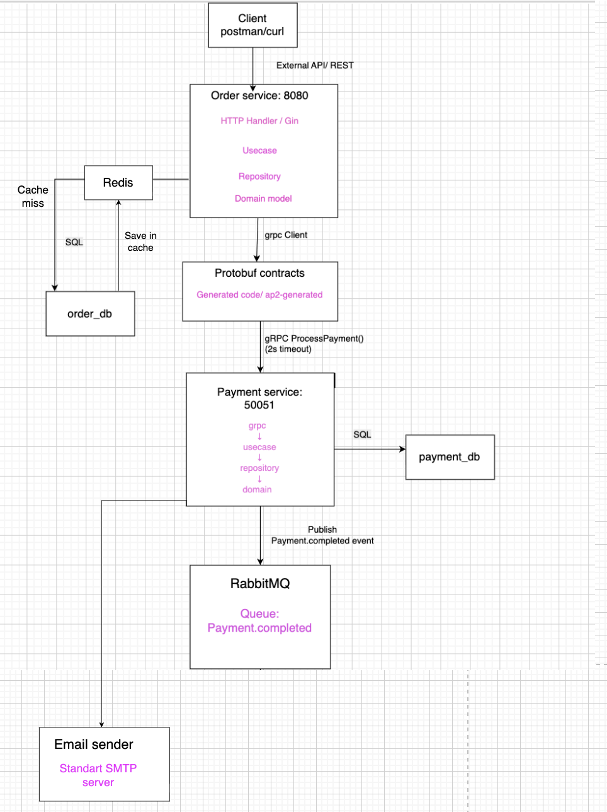
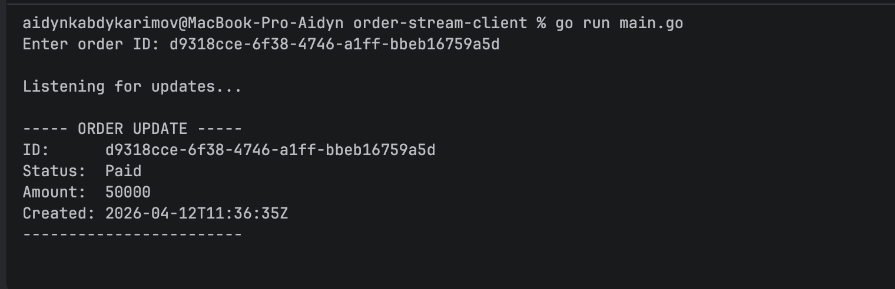
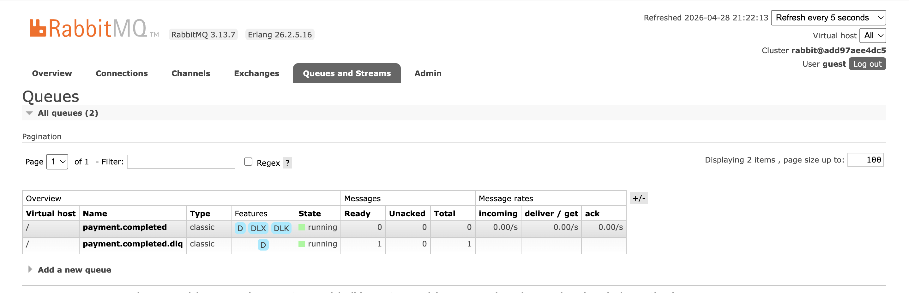
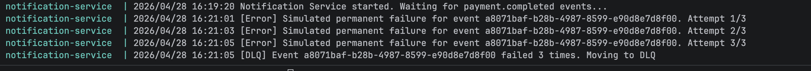

# Order & Payment Microservices (gRPC + REST)

##  Overview

This project implements a **three-service microservice system** using **Clean Architecture**, **gRPC**, and **REST**.

The system consists of:
- **Order Service** – handles order creation and state
- **Payment Service** – processes payments and enforces limits
- **Notification Service** – consumes events from Payment Service
External communication is done via **REST**, while internal service-to-service communication is implemented using **gRPC**.

---

##  Architecture



### Flow:
1. Client sends HTTP request → **Order Service**
2. Order Service stores order as `Pending`
3. Order Service calls **Payment Service via gRPC**
4. Payment Service returns:
    - `Authorized` → Order becomes `Paid`
    - `Declined` → Order becomes `Failed`
5. Order Service updates database
6. Payment Service publishes event (`payment.completed`)
7. **Notification Service consumes events from Payment Service**
8. Notification Service processes message and sends ACK
---

##  Microservices

### 1. Order Service
- REST API (Gin)
- gRPC server (for streaming updates)
- Own PostgreSQL database
- Handles:
    - Order creation
    - Idempotency
    - Status updates
    - Cancellation rules

### 2. Payment Service
- gRPC server only
- Own PostgreSQL database
- Handles:
    - Payment processing
    - Business rule: amount > 100000 → Declined
  
### 3. Notification Service
- Event consumer (RabbitMQ/NATS)
- Subscribes to events from **Payment Service**
- Handles:
    - Event processing
    - Idempotent consumption
    - Manual ACK logic
---

## Contract-First Approach

This project follows **Contract-First design** using Protobuf.

###  Proto Repository
Contains only `.proto` files:
👉 https://github.com/Moldirkab/ap2-protos

### ⚙ Generated Code Repository
Contains `.pb.go` files generated automatically via GitHub Actions:
👉 https://github.com/Moldirkab/ap2-generated

- GitHub Actions compiles `.proto` → Go code
- Versioned release is used: `v1.0.0`

---

##  Dependency Usage

Services import generated contracts using:

```bash
go get github.com/Moldirkab/ap2-generated@v1.0.0 
```
---
## Server-Side Streaming

To demonstrate gRPC capabilities, the Order Service also acts as a **gRPC Server** for order tracking.

### Streaming Endpoint
```proto
rpc SubscribeToOrderUpdates(OrderRequest) returns (stream OrderStatusUpdate);
```

## Idempotency Strategy and ACK Logic

### Idempotency Strategy

The Notification Service uses an idempotent consumer strategy to safely handle duplicate events.

Each incoming message contains a unique event identifier, such as `event_id` or `order_id`. Before processing the message, the consumer checks whether this event has already been processed.

If the event was already processed, the service does not repeat the same business logic. Instead, it skips duplicate processing and safely acknowledges the message.

This prevents duplicated actions such as:
- sending the same notification multiple times
- processing the same order event twice
- creating inconsistent data

In this project, idempotency is important because message brokers such as RabbitMQ or NATS can deliver the same message more than once, especially after retries, crashes, or network issues.

### ACK Logic

Manual acknowledgment is used to ensure message reliability.

The consumer acknowledges a message only after it has been successfully processed. This means the broker removes the message from the queue only when the service confirms that the work is completed.

The logic is:

1. Receive message from the broker.
2. Check if the event was already processed.
3. If it is a duplicate, acknowledge it and skip processing.
4. If it is new, process the event.
5. Save or mark the event as processed.
6. Send ACK to the broker.

If an error occurs during processing, the message is not acknowledged immediately. This allows the broker to redeliver the message later, so the system does not lose important events.

### Why This Approach Is Reliable

This design provides at-least-once delivery safety. Even if the same event is delivered multiple times, the idempotency check ensures that the result is applied only once.

Therefore, the system is both reliable and safe against duplicate message delivery.


### Dead Letter queue
I simulated a permanent error using fail@example.com.
The Notification Service retried processing the same event three times. After the third failure, it rejected the message without requeue, and RabbitMQ routed it to the dead letter queue payment.completed.dlq


##  Dead letter queue from terminal


# ⚡ Redis Usage

Redis is used as a shared in-memory data store for:

## 1. Cache-aside Pattern (Order Service)
- Order data is cached in Redis before querying the database
- Improves performance and reduces database load
- TTL is used (e.g., 5 minutes)
- Cache is invalidated when order status changes
- 
## 2. Idempotency (Notification Service)
- Prevents duplicate email sending
- Each event is stored in Redis: notification:<event_id>
### States:
- `processing` → currently being handled
- `done` → already processed

This ensures:
✔ No duplicate emails  
✔ Safe retries  
✔ Exactly-once processing behavior (practically)

---

## 3. API Rate Limiting (Order Service)

A Redis-based middleware limits API requests per IP.

### Key format:
rate_limit: <ip_address>
### Behavior:
- Each request increments Redis counter
- Limit: 10 requests per minute
- After limit is exceeded → HTTP 429 Too Many Requests
- TTL resets counter automatically

---

#  Notification Service

The Notification Service is a background worker that:

## Responsibilities:
- Consumes messages from RabbitMQ queue (`payment.completed`)
- Sends email notifications
- Ensures reliability using retries + idempotency

---

## 🔁 Retry Mechanism

If email sending fails:
- System retries up to 3 times
- Uses exponential backoff:
  - 2s → 4s → 8s

This ensures resilience against temporary failures.

---

##  Provider Adapter Pattern

Notification system supports multiple email providers:

### 1. Mock Provider (SIMULATED mode)
- Simulates network delay
- Random failures for testing retry logic
- Used for development/testing

### 2. SMTP Provider (REAL mode)
- Sends real emails via SMTP (e.g., Mailtrap)
- Used for production-like testing
