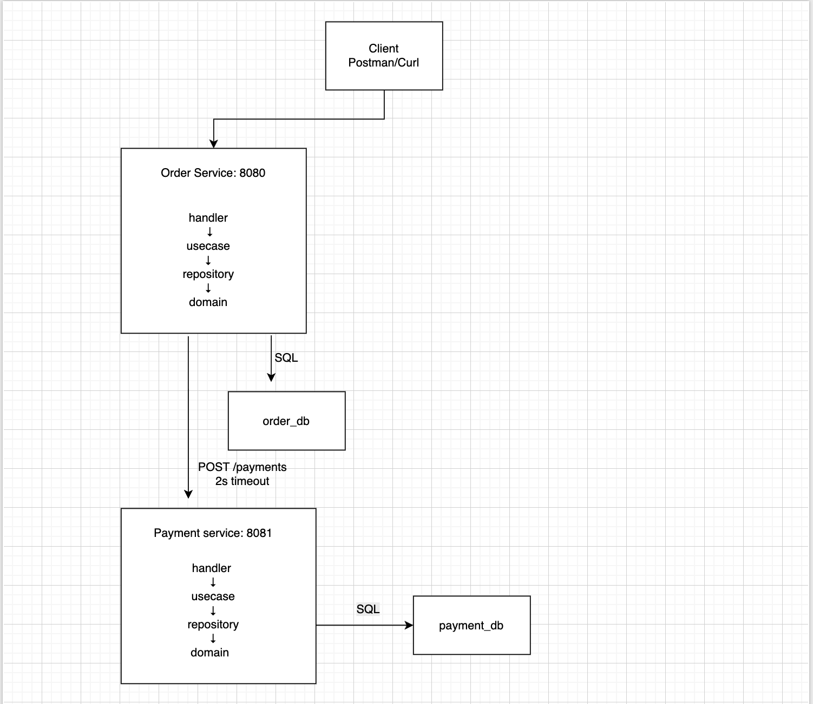

# AP2 Assignment 1 – Order & Payment Microservices

## Overview
A two-service platform built in Go using Clean Architecture principles.
Services communicate via REST only, each owns its own database.


---

## Clean Architecture
Each service follows strict layering:
```
delivery/transport  →  usecase  →  repository  →  database
                           ↑
                       interfaces (ports)
                       domain has zero dependencies
```

- **Domain** — pure Go structs, no imports from HTTP or DB
- **Usecase** — business logic only, depends on interfaces not implementations
- **Repository** — all SQL lives here, implements repository interface
- **Transport** — thin handlers, parse request → call usecase → return response
- **main.go** — manual dependency injection, composition root

---

## Bounded Contexts

### Order Context
- Owns the full order lifecycle: Pending → Paid / Failed / Cancelled
- Has its own `order_db` database
- Does NOT touch payment tables directly
- Calls Payment Service via HTTP to authorize payment

### Payment Context
- Owns payment authorization and transaction records
- Has its own `payment_db` database
- Does NOT know about orders — only receives payment requests
- Applies business rule: amount > 100000 → Declined

---

## Failure Handling

### Payment Service Unavailable
1. HTTP client timeout trips after **2 seconds**
2. Order is marked as **Failed**
3. Order Service returns **503 Service Unavailable**

**Why Failed and not Pending?**
Pending means "waiting for a payment attempt".
If the payment service is unreachable, the attempt was made but could not complete.
Marking as Failed is a clear terminal state — the client must submit a new order to retry.
Keeping it as Pending would be ambiguous and could lead to orphaned orders.

---
## Architecture Diagram


---
## Idempotency (Bonus)
Implemented via `Idempotency-Key` header on `POST /orders`.

- Client sends a unique key per intended operation
- If the same key is received again, the existing order is returned immediately
- No duplicate order or payment is created
- `NULL` is stored for requests without a key (allows multiple orders without keys)
- DB `UNIQUE` constraint on `idempotency_key` acts as a safety net
```
Same key -> returns existing order (200)
New key  -> creates new order (201)
No key -> not allowed
```
## API Examples

### 1. Create Order — Happy Path (Paid)
```
POST http://localhost:8080/orders
Content-Type: application/json
Idempotency-Key: order-laptop-001
```
Body:
```json
{
    "customer_id": "cust-1",
    "item_name": "Laptop",
    "amount": 50000
}
```
Expected `201`:
```json
{
    "ID": "abc-123",
    "CustomerID": "cust-1",
    "ItemName": "Laptop",
    "Amount": 50000,
    "Status": "Paid",
    "IdempotencyKey": "order-laptop-001"
}
```

---

### 2. Create Order — Declined (amount > 100000)
```
POST http://localhost:8080/orders
Content-Type: application/json
Idempotency-Key: order-ferrari-001
```
Body:
```json
{
    "customer_id": "cust-2",
    "item_name": "Ferrari",
    "amount": 200000
}
```
Expected `201`:
```json
{
    "ID": "xyz-456",
    "CustomerID": "cust-2",
    "ItemName": "Ferrari",
    "Amount": 200000,
    "Status": "Failed",
    "IdempotencyKey": "order-ferrari-001"
}
```

---

### 3. Idempotency — Send Same Request Twice
```
POST http://localhost:8080/orders
Content-Type: application/json
Idempotency-Key: order-laptop-001
```
Body:
```json
{
    "customer_id": "cust-1",
    "item_name": "Laptop",
    "amount": 50000
}
```
Expected `200` (already existed, same order returned):
```json
{
    "ID": "abc-123",
    "Status": "Paid",
    "IdempotencyKey": "order-laptop-001"
}
```
Same ID as request 1 ✅ No duplicate in database ✅

---

### 4. Get Order by ID
```
GET http://localhost:8080/orders/abc-123
```
Expected `200`:
```json
{
    "ID": "abc-123",
    "CustomerID": "cust-1",
    "ItemName": "Laptop",
    "Amount": 50000,
    "Status": "Paid",
    "IdempotencyKey": "order-laptop-001"
}
```

---

### 5. Cancel Order — Then Try to Cancel Paid Order
First create a new order:
```
POST http://localhost:8080/orders
Content-Type: application/json
Idempotency-Key: order-phone-001
```
Body:
```json
{
    "customer_id": "cust-3",
    "item_name": "Phone",
    "amount": 30000
}
```
Then try to cancel it (Status is Paid):
```
PATCH http://localhost:8080/orders/{id}/cancel
```
Expected `400`:
```json
{
    "error": "only pending orders can be cancelled"
}
```