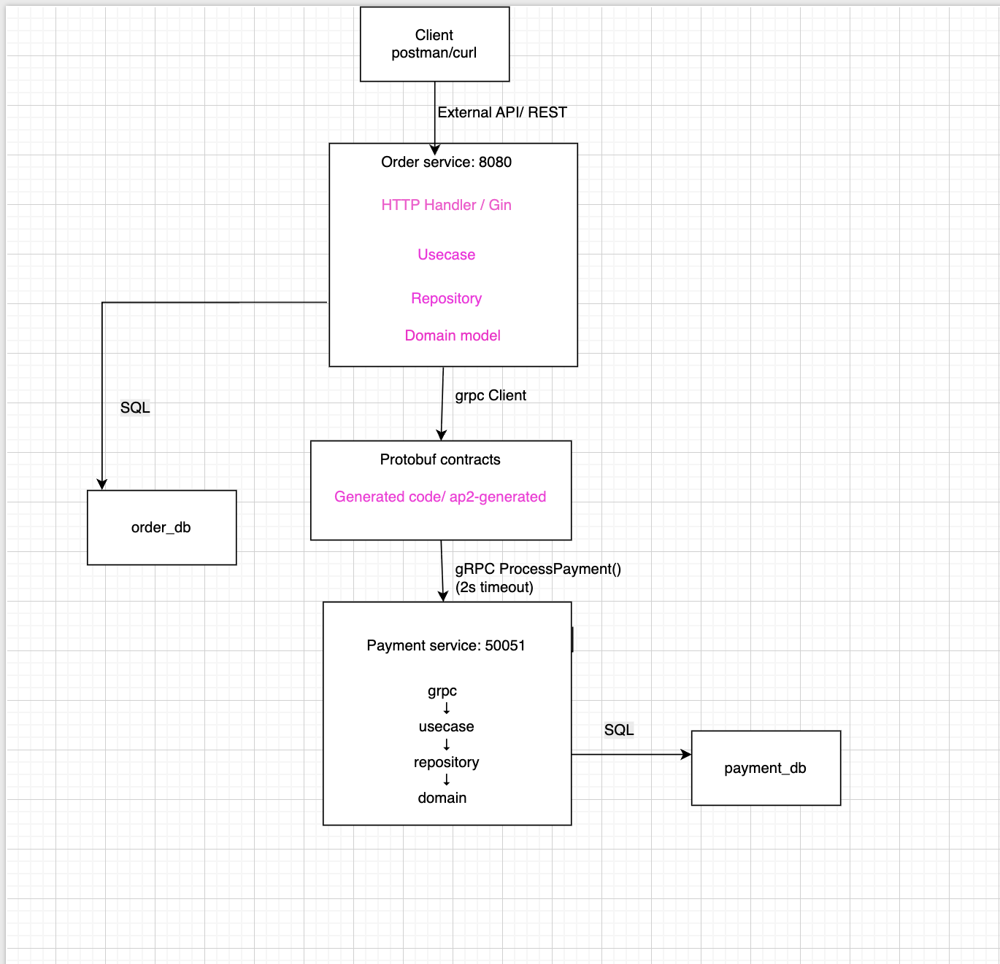

# Order & Payment Microservices (gRPC + REST)

##  Overview

This project implements a **two-service microservice system** using **Clean Architecture**, **gRPC**, and **REST**.

The system consists of:
- **Order Service** – handles order creation and state
- **Payment Service** – processes payments and enforces limits

External communication is done via **REST**, while internal service-to-service communication is implemented using **gRPC**.

---

##  Architecture



### Flow:
1. Client sends HTTP request → Order Service
2. Order Service stores order as `Pending`
3. Order Service calls Payment Service via gRPC
4. Payment Service returns:
    - `Authorized` → Order becomes `Paid`
    - `Declined` → Order becomes `Failed`
5. Order Service updates database

---

##  Microservices

### 1. Order Service
- REST API (Gin)
- gRPC server (for streaming updates)
- Own PostgreSQL database
- Handles:
    - Order creation
    - Idempotency
    - Status updates
    - Cancellation rules

### 2. Payment Service
- gRPC server only
- Own PostgreSQL database
- Handles:
    - Payment processing
    - Business rule: amount > 100000 → Declined

---

## Contract-First Approach

This project follows **Contract-First design** using Protobuf.

###  Proto Repository
Contains only `.proto` files:
👉 https://github.com/Moldirkab/ap2-protos

### ⚙ Generated Code Repository
Contains `.pb.go` files generated automatically via GitHub Actions:
👉 https://github.com/Moldirkab/ap2-generated

- GitHub Actions compiles `.proto` → Go code
- Versioned release is used: `v1.0.0`

---

##  Dependency Usage

Services import generated contracts using:

```bash
go get github.com/Moldirkab/ap2-generated@v1.0.0 
```
---
## Server-Side Streaming

To demonstrate gRPC capabilities, the Order Service also acts as a **gRPC Server** for order tracking.

### Streaming Endpoint
```proto
rpc SubscribeToOrderUpdates(OrderRequest) returns (stream OrderStatusUpdate);
```
